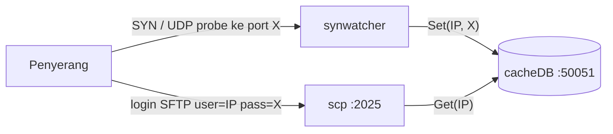

# synwatcher

Detektor **port scan** (nmap `-sS`, `-sT`, `-sU`) untuk Windows, bagian dari honeypot
[n0z0/scp](https://github.com/n0z0/scp).

Setiap kali sebuah IP men-scan port di mesin ini, synwatcher menyimpan pasangan
**IP → port** ke [cacheDB](https://github.com/n0z0/cachedb). Server SFTP `scp` lalu
menerima login dengan:

| Field    | Nilai                          |
|----------|--------------------------------|
| Username | IP penyerang                   |
| Password | Port **terakhir** yang di-scan |



---

## Untuk pengguna

### Kebutuhan

1. **Windows 64-bit**
2. **[Npcap](https://npcap.com/#download)**: saat instalasi, centang
   *Install Npcap in WinPcap API-compatible Mode*
3. **cacheDB** berjalan di `127.0.0.1:50051`
4. (Opsional) **scp** berjalan di port `2025`

### Instalasi

Unduh `synwatcher_vX.Y.Z_windows_amd64.zip` dari halaman
[Releases](https://github.com/n0z0/synwatcher/releases/latest), lalu ekstrak.
Untuk memeriksa integritas file, cocokkan hash-nya dengan `checksums.txt`:

```powershell
Get-FileHash .\synwatcher_*_windows_amd64.zip -Algorithm SHA256
```

### Menjalankan

1. Cari GUID interface jaringan yang ingin dipantau:

   ```powershell
   Get-NetAdapter | Select Name, InterfaceDescription, InterfaceGuid, ifIndex, Status
   ```

   (atau jalankan `.\getnet.ps1`)

2. Jalankan synwatcher (PowerShell **Administrator**), ganti `{GUID}` dengan
   `InterfaceGuid` di atas:

   ```powershell
   .\synwatcher.exe -iface "\Device\NPF_{A91E7D86-E24B-4761-94EF-DE993C6116BD}"
   ```

   Tanpa `-iface`, synwatcher memilih interface pertama yang punya alamat IP.
   Pilihan otomatis ini belum tentu interface yang benar.

3. **Periksa log saat start.** IP mesin ini harus muncul:

   ```
   [*] Local IPs on \Device\NPF_{...}: [192.168.1.10 fe80::... 127.0.0.1 ::1]
   ```

   Kalau hanya `127.0.0.1` dan `::1` yang muncul, interface-nya salah dan
   **scan tidak akan terdeteksi**.

### Opsi command line

| Flag       | Default         | Keterangan                                   |
|------------|-----------------|----------------------------------------------|
| `-iface`   | *(auto)*        | Nama device Npcap `\Device\NPF_{GUID}`       |
| `-bpf`     | *(lihat bawah)* | Filter BPF untuk paket yang ditangkap        |
| `-snaplen` | `96`            | Jumlah byte yang diambil per paket           |
| `-promisc` | `true`          | Mode promiscuous                             |
| `-timeout` | `BlockForever`  | Timeout pembacaan pcap                       |
| `-version` |                 | Tampilkan versi lalu keluar                  |

### Apa yang terdeteksi

| Jenis                      | Sumber yang diterima                       | Disimpan ke cacheDB |
|----------------------------|--------------------------------------------|---------------------|
| TCP SYN (`-sS`, `-sT`)     | IP mana saja (LAN & internet)              | ✅                  |
| UDP (`-sU`)                | Hanya IP privat (`10/8`, `172.16/12`, `192.168/16`, link-local) | ✅ |
| ICMP Port Unreachable      | –                                          | ❌ hanya log        |

Semua paket hanya diproses jika **tujuannya IP mesin ini**. Paket berikut diabaikan:

- trafik keluar dari mesin ini sendiri dan loopback
- port SFTP honeypot (`2025`), supaya login ke SFTP tidak menimpa password
- UDP port `53, 443, 123, 161, 1900, 5353` (DNS, QUIC, NTP, SNMP, SSDP, mDNS)

> **Catatan:** UDP dari internet sengaja tidak dideteksi. Balasan UDP dari
> aplikasi biasa (Zoom, game, VPN) tidak bisa dibedakan dari scan, dan akan
> mengisi cacheDB dengan data palsu.

### Troubleshooting

| Gejala | Penyebab / solusi |
|--------|-------------------|
| `Tidak menemukan interface Npcap` | Npcap belum terinstal, atau terminal tidak dijalankan sebagai Administrator |
| `OpenLive gagal` | GUID di `-iface` salah. Cek lagi dengan `Get-NetAdapter` |
| `Failed to connect` | cacheDB belum berjalan di `127.0.0.1:50051` |
| Scan tidak terdeteksi | Cek log `Local IPs`, dan pastikan firewall tidak memblok paket sebelum Npcap |

---

## Untuk developer

### Kebutuhan

- [Go](https://go.dev/dl/) sesuai versi di [`go.mod`](go.mod)
- Npcap (untuk menjalankan, tidak diperlukan untuk compile)
- **Tidak perlu cgo/gcc.** Di Windows, gopacket memuat `wpcap.dll` saat runtime

### Build & jalankan

```powershell
go build -o synwatcher.exe .
.\synwatcher.exe -iface "\Device\NPF_{GUID}"
```

Build lokal menampilkan versi `dev`. Untuk mengisi versi secara manual:

```powershell
go build -trimpath -ldflags "-s -w -X main.version=v0.0.0-local" -o synwatcher.exe .
```

Sebelum commit:

```powershell
go vet ./...
gofmt -l .   # di Windows bisa muncul karena CRLF; Git otomatis mengubahnya ke LF
```

### Struktur kode

| File | Isi |
|------|-----|
| [`main.go`](main.go) | Entry point: pilih interface, buka pcap, konek cacheDB, loop paket |
| [`config.go`](config.go) | Flag CLI, filter BPF, alamat cacheDB, port SFTP yang diabaikan |
| [`paket.go`](paket.go) | `handlePacket`: logika deteksi TCP / UDP / ICMP |
| [`localip.go`](localip.go) | Daftar rentang IP privat (`isLocalIP`) |
| [`helper.go`](helper.go) | Kumpulkan IP lokal milik interface |
| [`report.go`](report.go) | Tabel jumlah hit per IP di console |

### Konfigurasi yang masih hard-coded

Ada di [`config.go`](config.go):

- `cacheDB = "127.0.0.1:50051"`: alamat cacheDB
- `sftpPort = 2025`: port scp yang tidak disimpan

Untuk mendeteksi UDP dari rentang lain (misalnya CGNAT `100.64.0.0/10`),
tambahkan CIDR-nya ke `cidrs` di [`localip.go`](localip.go).

### Keterbatasan

- Hanya **Windows amd64**. gopacket v1.1.19 tidak mendukung windows/arm64.
  Build Linux membutuhkan cgo + `libpcap-dev`.
- cacheDB menyimpan satu nilai per IP, jadi hanya port terakhir yang tersimpan.

---

## Release

Release dibuat otomatis oleh [GitHub Actions](.github/workflows/release.yml).
Workflow ini menjalankan `go vet`, compile `synwatcher.exe`, lalu meng-upload zip
dan `checksums.txt` ke halaman Releases.

**Otomatis: push ke `main`**

Setiap push ke `main` langsung merilis versi **patch** berikutnya
(contoh `v0.1.3` → `v0.1.4`). Pengecualiannya:

- push yang hanya mengubah `*.md` atau `LICENSE` tidak memicu release
- tambahkan `[skip ci]` di pesan commit untuk melewati release

**Naik versi minor/major: lewat tombol**

GitHub → tab **Actions** → **Release** → **Run workflow** → pilih `minor` / `major`.

**Versi tertentu: push tag manual**

```sh
git tag v1.0.0
git push origin v1.0.0
```

> Kalau langkah release gagal dengan error permission, buka
> **Settings → Actions → General → Workflow permissions** dan pilih
> **Read and write permissions**.

## Lisensi

[GNU AGPL v3](LICENSE)
